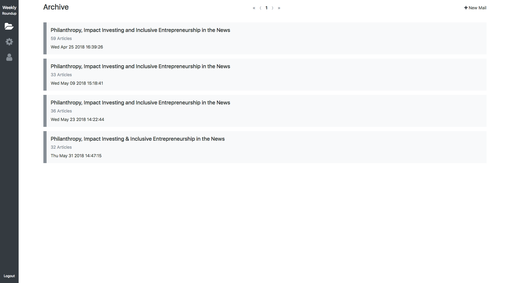

# Weekly Roundup

Weekly Roundup is a news clipping and emailing tool built for the Case Foundation's internal communications team. The tool scrapes metadata (title, date, publicaiton, and description) from submitted URLs, then formats the information into a newsletter that users may organize and edit before sending. The system distributes the newsletter via SendGrid.

## About

## Setup

See [Setup](doc/Setup.md) 

## Contributing

See [Contributing](Contributing.md) for additional information.

## License

See [License](License.txt) for additional information.
